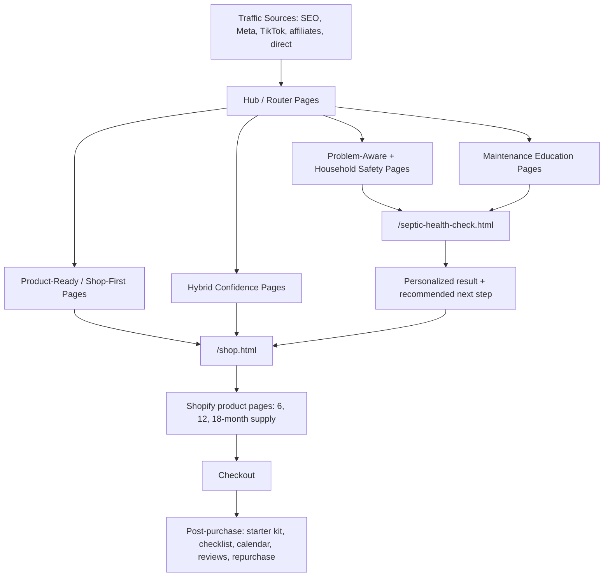

# Maintane Funnel Page Architecture

Generated: 2026-05-14

This is the routing blueprint for every current Maintane HTML page in staging. It answers: where does this page sit in the funnel, what should the primary CTA be, and why?

## Visual Map

## Lane Rules

- **Hub / Router:** Offer both `Shop Maintane` and `Take the Health Check`.
- **Direct-to-Shop / Product-Ready:** Push to `/shop.html`; use quiz only as a hesitation bridge.
- **Hybrid Confidence:** Shop primary, Health Check secondary.
- **Problem-Aware / Maintenance / Household Safety:** Health Check primary, shop secondary or lower on page.
- **Local SEO:** Shop primary, education secondary.
- **Post-purchase / Internal / Noindex:** Not public SEO. Use after checkout or internally.

## Page Counts By Lane

- **Hub / Router:** 9 pages
- **Direct-to-Shop / Checkout:** 2 pages
- **Product-Ready / Shop-First:** 19 pages
- **Hybrid Confidence / Shop + Health Check:** 17 pages
- **Problem-Aware / Health Check-First:** 34 pages
- **Maintenance Education / Health Check-First:** 15 pages
- **Household Safety / Health Check-First:** 17 pages
- **Local SEO / Shop-First Education:** 13 pages
- **SEO Education / Health Check-First:** 11 pages
- **Health Check / Diagnostic Capture:** 1 pages
- **Post-purchase / Internal / Noindex:** 7 pages
- **Utility / Trust:** 1 pages
- **Legacy / Prelaunch Capture:** 1 pages

## Full Page Routing Map

### Hub / Router

| URL | Page | Primary CTA | Why |
|---|---|---|---|
| `/` | Maintane \| Natural Septic Defense Powered by Live Bacteria | Split CTA: Shop + Health Check | Navigation hub that routes product-ready users to shop and unsure users to quiz. |
| `/blog/` | Septic Tank Maintenance Guides for Homeowners \| Maintane | Split CTA: Shop + Health Check | Navigation hub that routes product-ready users to shop and unsure users to quiz. |
| `/blog/best-practices/` | Septic Best Practices and Home Care Guides \| Maintane | Split CTA: Shop + Health Check | Navigation hub that routes product-ready users to shop and unsure users to quiz. |
| `/blog/getting-started/` | Septic System Basics for New Homeowners \| Maintane | Split CTA: Shop + Health Check | Navigation hub that routes product-ready users to shop and unsure users to quiz. |
| `/blog/kid-pet-safe/` | Kid and Pet Safe Septic Care Guides \| Maintane | Split CTA: Shop + Health Check | Navigation hub that routes product-ready users to shop and unsure users to quiz. |
| `/blog/the-science/` | Septic Bacteria and System Science Guides \| Maintane | Split CTA: Shop + Health Check | Navigation hub that routes product-ready users to shop and unsure users to quiz. |
| `/blog/treatment/` | Septic Treatment Guides for Monthly Tank Defense \| Maintane | Split CTA: Shop + Health Check | Navigation hub that routes product-ready users to shop and unsure users to quiz. |
| `/blog/warning-signs/` | Septic Warning Signs and Problem Guides \| Maintane | Split CTA: Shop + Health Check | Navigation hub that routes product-ready users to shop and unsure users to quiz. |
| `/free-septic-resources.html` | Free Septic Health Check & Homeowner Resources \| Maintane | Split CTA: Shop + Health Check | Navigation hub that routes product-ready users to shop and unsure users to quiz. |
### Direct-to-Shop / Checkout

| URL | Page | Primary CTA | Why |
|---|---|---|---|
| `/products.html` | Maintane Natural Septic Tank Treatment | Buy supply | Bottom-of-funnel purchase page. Send warm traffic here. |
| `/shop.html` | Shop Maintane \| Natural Septic Treatment Bundles | Buy supply | Bottom-of-funnel purchase page. Send warm traffic here. |
### Product-Ready / Shop-First

| URL | Page | Primary CTA | Why |
|---|---|---|---|
| `/best-septic-treatment.html` | Best Septic Treatment: Biology-First Buying Criteria \| Maintane | Shop Maintane | Visitor is comparing treatments, ingredients, or monthly septic care. Send to shop. |
| `/blog/are-septic-treatments-safe-for-babies-and-toddlers.html` | Are Septic Treatments Safe for Babies and Toddlers? \| Maintane | Shop Maintane | Visitor is comparing treatments, ingredients, or monthly septic care. Send to shop. |
| `/blog/best-septic-treatment-for-monthly-maintenance.html` | Best Septic Treatment for Monthly Tank Defense \| Maintane | Shop Maintane | Visitor is comparing treatments, ingredients, or monthly septic care. Send to shop. |
| `/blog/do-you-need-septic-treatment-if-you-pump-regularly.html` | Do You Need Septic Treatment if You Pump Regularly? \| Maintane | Shop Maintane | Visitor is comparing treatments, ingredients, or monthly septic care. Send to shop. |
| `/blog/how-often-septic-treatment.html` | How Often Should You Use Septic Tank Treatment? | Shop Maintane | Visitor is comparing treatments, ingredients, or monthly septic care. Send to shop. |
| `/blog/maintane-vs-ridx.html` | Maintane vs. Rid-X: An Honest Ingredient Comparison \| Maintane | Shop Maintane | Visitor is comparing treatments, ingredients, or monthly septic care. Send to shop. |
| `/blog/natural-vs-chemical-septic-treatment.html` | Natural Septic Tank Treatment vs Chemical \| Maintane | Shop Maintane | Visitor is comparing treatments, ingredients, or monthly septic care. Send to shop. |
| `/blog/powder-vs-liquid-septic-treatment.html` | Powder vs Liquid Septic Treatment: Which Is Better? \| Maintane | Shop Maintane | Visitor is comparing treatments, ingredients, or monthly septic care. Send to shop. |
| `/blog/septic-treatments-safe-for-pets.html` | Are Septic Tank Treatments Safe for Pets? An Ingredient-by-Ingredient Breakdown \| Maintane | Shop Maintane | Visitor is comparing treatments, ingredients, or monthly septic care. Send to shop. |
| `/blog/truth-about-septic-tank-additives.html` | Do Septic Tank Additives Work? \| Maintane | Shop Maintane | Visitor is comparing treatments, ingredients, or monthly septic care. Send to shop. |
| `/blog/what-to-look-for-in-a-septic-tank-treatment.html` | What to Look for in a Septic Tank Treatment \| Maintane | Shop Maintane | Visitor is comparing treatments, ingredients, or monthly septic care. Send to shop. |
| `/chemical-free-septic-treatment.html` | Chemical-Free Septic Treatment With No Harsh Chemicals \| Maintane | Shop Maintane | Visitor is comparing treatments, ingredients, or monthly septic care. Send to shop. |
| `/monthly-septic-treatment.html` | Monthly Septic Treatment Schedule for Natural Tank Defense \| Maintane | Shop Maintane | Visitor is comparing treatments, ingredients, or monthly septic care. Send to shop. |
| `/natural-septic-treatment-vs-septic-shock.html` | Natural Septic Treatment vs Septic Shock Products \| Maintane | Shop Maintane | Visitor is comparing treatments, ingredients, or monthly septic care. Send to shop. |
| `/natural-septic-treatment.html` | Natural Septic Treatment Powered by Six Bacterial Strains \| Maintane | Shop Maintane | Visitor is comparing treatments, ingredients, or monthly septic care. Send to shop. |
| `/ridx-alternative.html` | Rid-X Alternative for Natural Septic Defense \| Maintane | Shop Maintane | Visitor is comparing treatments, ingredients, or monthly septic care. Send to shop. |
| `/septic-treatment-powder-vs-liquid.html` | Septic Treatment Powder vs Liquid \| Maintane | Shop Maintane | Visitor is comparing treatments, ingredients, or monthly septic care. Send to shop. |
| `/septic-treatment-powder.html` | Septic Treatment Powder vs Liquid: Natural Septic Defense \| Maintane | Shop Maintane | Visitor is comparing treatments, ingredients, or monthly septic care. Send to shop. |
| `/septic-treatment.html` | Septic Treatment for Odor, Buildup & Natural Tank Defense | Shop Maintane | Visitor is comparing treatments, ingredients, or monthly septic care. Send to shop. |
### Hybrid Confidence / Shop + Health Check

| URL | Page | Primary CTA | Why |
|---|---|---|---|
| `/blog/best-septic-treatment-for-homes-with-garbage-disposals.html` | Best Septic Treatment for Homes With Garbage Disposals \| Maintane | Shop Maintane | Buyer education page. Shop primary, Health Check secondary for hesitation. |
| `/blog/can-bleach-kill-septic-tank-bacteria.html` | Can Bleach Kill Septic Tank Bacteria? \| Maintane | Shop Maintane | Mechanism or usage-confidence content. Shop primary, quiz secondary. |
| `/blog/dosing-guide.html` | Dosing Guide — Maintane | Shop Maintane | Mechanism or usage-confidence content. Shop primary, quiz secondary. |
| `/blog/how-bacteria-keep-septic-healthy.html` | How Septic Tank Bacteria Keep Your System Healthy | Shop Maintane | Mechanism or usage-confidence content. Shop primary, quiz secondary. |
| `/blog/what-kills-septic-tank-bacteria.html` | What Kills Septic Tank Bacteria? \| Maintane | Shop Maintane | Mechanism or usage-confidence content. Shop primary, quiz secondary. |
| `/dosing-guide.html` | Maintane Dosing Guide \| Once-Monthly Septic Defense | Shop Maintane | Mechanism or usage-confidence content. Shop primary, quiz secondary. |
| `/how-it-works.html` | How Maintane Works \| Natural Septic Defense with Live Bacteria | Shop Maintane | Mechanism or usage-confidence content. Shop primary, quiz secondary. |
| `/natural-septic-treatment-for-families.html` | Natural Septic Treatment for Families \| Maintane | Shop Maintane | Buyer education page. Shop primary, Health Check secondary for hesitation. |
| `/natural-septic-treatment-ingredients.html` | Natural Septic Treatment Ingredients \| Maintane | Shop Maintane | Buyer education page. Shop primary, Health Check secondary for hesitation. |
| `/natural-septic-treatment-smell-slow-drains.html` | Natural Septic Treatment for Smell and Slow Drains \| Maintane | Shop Maintane | Buyer education page. Shop primary, Health Check secondary for hesitation. |
| `/septic-treatment-after-pumping.html` | Septic Treatment After Pumping: What to Do Next \| Maintane | Shop Maintane | Buyer education page. Shop primary, Health Check secondary for hesitation. |
| `/septic-treatment-for-garbage-disposals.html` | Septic Treatment for Homes With Garbage Disposals \| Maintane | Shop Maintane | Buyer education page. Shop primary, Health Check secondary for hesitation. |
| `/septic-treatment-for-homes-with-kids-and-pets.html` | Septic Treatment for Homes With Kids and Pets \| Maintane | Shop Maintane | Buyer education page. Shop primary, Health Check secondary for hesitation. |
| `/septic-treatment-for-new-homeowners.html` | New Homeowner Septic Care & Treatment Guide \| Maintane | Shop Maintane | Buyer education page. Shop primary, Health Check secondary for hesitation. |
| `/septic-treatment-for-older-homes.html` | Septic Treatment for Older Homes \| Maintane | Shop Maintane | Buyer education page. Shop primary, Health Check secondary for hesitation. |
| `/septic-treatment-for-rental-homes.html` | Septic Treatment for Rental Homes, Cabins, and Airbnbs \| Maintane | Shop Maintane | Buyer education page. Shop primary, Health Check secondary for hesitation. |
| `/septic-treatment-for-vacation-homes.html` | Septic Treatment for Vacation Homes and Cabins \| Maintane | Shop Maintane | Buyer education page. Shop primary, Health Check secondary for hesitation. |
### Problem-Aware / Health Check-First

| URL | Page | Primary CTA | Why |
|---|---|---|---|
| `/blog/are-septic-fumes-harmful-to-kids-and-pets.html` | Are Septic Fumes Harmful to Kids and Pets? \| Maintane | Take the Health Check | Visitor is diagnosing risk or symptoms. Capture and route before product pitch. |
| `/blog/can-dogs-play-over-a-septic-drain-field.html` | Can Dogs Play Over a Septic Drain Field? \| Maintane | Take the Health Check | Visitor is diagnosing risk or symptoms. Capture and route before product pitch. |
| `/blog/how-rain-affects-your-septic-drain-field.html` | How Rain Affects Your Septic Drain Field \| Maintane | Take the Health Check | Visitor is diagnosing risk or symptoms. Capture and route before product pitch. |
| `/blog/how-to-know-septic-tank-full.html` | How to Know If Your Septic Tank Is Full \| Maintane | Take the Health Check | Visitor is diagnosing risk or symptoms. Capture and route before product pitch. |
| `/blog/rotten-egg-smell-in-bathroom-septic.html` | Rotten Egg Smell in Bathroom With Septic: Causes & Fixes | Take the Health Check | Visitor is diagnosing risk or symptoms. Capture and route before product pitch. |
| `/blog/septic-backup-first-24-hours.html` | Septic Backup: What to Do in the First 24 Hours \| Maintane | Take the Health Check | Visitor is diagnosing risk or symptoms. Capture and route before product pitch. |
| `/blog/septic-pump-running-all-the-time.html` | Why Is My Septic Pump Running All the Time? \| Maintane | Take the Health Check | Visitor is diagnosing risk or symptoms. Capture and route before product pitch. |
| `/blog/septic-smell-outside-after-rain.html` | Septic Smell Outside After Rain: What It Can Mean \| Maintane | Take the Health Check | Visitor is diagnosing risk or symptoms. Capture and route before product pitch. |
| `/blog/septic-tank-full-or-clogged-drain.html` | Septic Tank Full or Clogged Drain? How to Tell \| Maintane | Take the Health Check | Visitor is diagnosing risk or symptoms. Capture and route before product pitch. |
| `/blog/septic-tank-warning-signs.html` | 7 Septic Tank Warning Signs You Shouldn't Ignore \| Maintane | Take the Health Check | Visitor is diagnosing risk or symptoms. Capture and route before product pitch. |
| `/blog/shower-drain-smells-like-sewer-septic.html` | Shower Drain Smells Like Sewer in a Septic Home \| Maintane | Take the Health Check | Visitor is diagnosing risk or symptoms. Capture and route before product pitch. |
| `/blog/signs-your-drain-field-is-failing.html` | Signs Your Drain Field Is Failing \| Maintane | Take the Health Check | Visitor is diagnosing risk or symptoms. Capture and route before product pitch. |
| `/blog/slow-drains-septic-or-clog.html` | Slow Drains: Septic Problem or Just a Clog? \| Maintane | Take the Health Check | Visitor is diagnosing risk or symptoms. Capture and route before product pitch. |
| `/blog/standing-water-over-septic-drain-field.html` | Standing Water Over a Septic Drain Field: What It Means \| Maintane | Take the Health Check | Visitor is diagnosing risk or symptoms. Capture and route before product pitch. |
| `/blog/toilet-bubbling-on-septic-system.html` | Toilet Bubbling on a Septic System: What to Check \| Maintane | Take the Health Check | Visitor is diagnosing risk or symptoms. Capture and route before product pitch. |
| `/blog/what-to-plant-over-septic-drain-field.html` | What to Plant Over a Septic Drain Field \| Maintane | Take the Health Check | Visitor is diagnosing risk or symptoms. Capture and route before product pitch. |
| `/blog/why-are-my-toilets-gurgling-on-septic.html` | Why Are My Toilets Gurgling on a Septic System? \| Maintane | Take the Health Check | Visitor is diagnosing risk or symptoms. Capture and route before product pitch. |
| `/blog/why-does-my-house-smell-like-septic.html` | Why Does My House Smell Like Septic? \| Maintane | Take the Health Check | Visitor is diagnosing risk or symptoms. Capture and route before product pitch. |
| `/blog/why-is-my-septic-alarm-going-off.html` | Why Is My Septic Alarm Going Off? \| Maintane | Take the Health Check | Visitor is diagnosing risk or symptoms. Capture and route before product pitch. |
| `/blog/why-septic-system-smells.html` | Septic System Smell Fix: Causes & Solutions \| Maintane | Take the Health Check | Visitor is diagnosing risk or symptoms. Capture and route before product pitch. |
| `/rotten-egg-smell-septic.html` | Rotten Egg Smell and Septic Systems: What It Can Mean \| Maintane | Take the Health Check | Visitor is diagnosing risk or symptoms. Capture and route before product pitch. |
| `/septic-alarm-going-off.html` | Septic Alarm Going Off? What to Check First \| Maintane | Take the Health Check | Visitor is diagnosing risk or symptoms. Capture and route before product pitch. |
| `/septic-backup.html` | Septic Backup: First Steps and Monthly Prevention \| Maintane | Take the Health Check | Visitor is diagnosing risk or symptoms. Capture and route before product pitch. |
| `/septic-drain-field-care-checklist.html` | Septic Drain Field Defense Guide \| Maintane | Take the Health Check | Visitor is diagnosing risk or symptoms. Capture and route before product pitch. |
| `/septic-smell-checklist.html` | Septic Smell Checklist for Homeowners \| Maintane | Take the Health Check | Visitor is diagnosing risk or symptoms. Capture and route before product pitch. |
| `/septic-smell-outside.html` | Septic Smell Outside: Yard, Tank, and Drain Field \| Maintane | Take the Health Check | Visitor is diagnosing risk or symptoms. Capture and route before product pitch. |
| `/septic-smell.html` | Septic Smell: Causes, What to Check & Natural Treatment \| Maintane | Take the Health Check | Visitor is diagnosing risk or symptoms. Capture and route before product pitch. |
| `/septic-tank-full-signs.html` | Septic Tank Full Signs: What Homeowners Notice First \| Maintane | Take the Health Check | Visitor is diagnosing risk or symptoms. Capture and route before product pitch. |
| `/septic-tank-smell-in-house.html` | Septic Tank Smell in House: What to Check \| Maintane | Take the Health Check | Visitor is diagnosing risk or symptoms. Capture and route before product pitch. |
| `/shower-drain-smells-septic.html` | Shower Drain Smells in a Septic Home: What to Check \| Maintane | Take the Health Check | Visitor is diagnosing risk or symptoms. Capture and route before product pitch. |
| `/slow-drains.html` | Slow Drains on Septic: Clog or Septic Warning Sign? \| Maintane | Take the Health Check | Visitor is diagnosing risk or symptoms. Capture and route before product pitch. |
| `/standing-water-drain-field.html` | Standing Water Over Septic Drain Field: What It Can Mean \| Maintane | Take the Health Check | Visitor is diagnosing risk or symptoms. Capture and route before product pitch. |
| `/toilet-bubbling-septic.html` | Toilet Bubbling on Septic: Causes and First Checks \| Maintane | Take the Health Check | Visitor is diagnosing risk or symptoms. Capture and route before product pitch. |
| `/toilets-gurgling-septic.html` | Toilets Gurgling on Septic: What It Can Mean \| Maintane | Take the Health Check | Visitor is diagnosing risk or symptoms. Capture and route before product pitch. |
### Maintenance Education / Health Check-First

| URL | Page | Primary CTA | Why |
|---|---|---|---|
| `/blog/how-often-pump-1000-gallon-septic-tank.html` | How Often Should You Pump a 1,000 Gallon Septic Tank? \| Maintane | Take the Health Check | Visitor wants planning, cost, or maintenance guidance. Quiz is the best next step. |
| `/blog/how-to-maintain-septic-tank.html` | How to Maintain a Septic Tank: Complete Homeowner Checklist | Take the Health Check | Visitor wants planning, cost, or maintenance guidance. Quiz is the best next step. |
| `/blog/monthly-septic-maintenance-checklist.html` | Monthly Septic Maintenance Checklist \| Maintane | Take the Health Check | Visitor wants planning, cost, or maintenance guidance. Quiz is the best next step. |
| `/blog/pet-safe-septic-maintenance-checklist.html` | Pet-Safe Septic Maintenance Checklist \| Maintane | Take the Health Check | Visitor wants planning, cost, or maintenance guidance. Quiz is the best next step. |
| `/blog/septic-inspection-checklist-before-buying-house.html` | Septic Inspection Checklist Before Buying a House \| Maintane | Take the Health Check | Visitor wants planning, cost, or maintenance guidance. Quiz is the best next step. |
| `/blog/septic-maintenance-for-vacation-homes-and-cabins.html` | Septic Maintenance for Vacation Homes and Cabins \| Maintane | Take the Health Check | Visitor wants planning, cost, or maintenance guidance. Quiz is the best next step. |
| `/blog/septic-maintenance-new-homeowners.html` | First-Time Septic Owner Checklist: Your First 30 Days \| Maintane | Take the Health Check | Visitor wants planning, cost, or maintenance guidance. Quiz is the best next step. |
| `/blog/septic-tank-cleaning-cost.html` | Septic Tank Cleaning Cost: 2026 Pumping & Maintenance Guide | Take the Health Check | Visitor wants planning, cost, or maintenance guidance. Quiz is the best next step. |
| `/first-30-days-with-a-septic-system.html` | First 30 Days With a Septic System \| Maintane | Take the Health Check | Visitor wants planning, cost, or maintenance guidance. Quiz is the best next step. |
| `/seasonal-septic-maintenance-checklist.html` | Seasonal Septic Maintenance Checklist \| Maintane | Take the Health Check | Visitor wants planning, cost, or maintenance guidance. Quiz is the best next step. |
| `/septic-care-checklist.html` | Free Septic Defense Guide for Homeowners \| Maintane | Take the Health Check | Visitor wants planning, cost, or maintenance guidance. Quiz is the best next step. |
| `/septic-inspection-checklist.html` | Septic Inspection Checklist for Homebuyers \| Maintane | Take the Health Check | Visitor wants planning, cost, or maintenance guidance. Quiz is the best next step. |
| `/septic-maintenance-calendar.html` | Septic Maintenance Calendar for Homeowners \| Maintane | Take the Health Check | Visitor wants planning, cost, or maintenance guidance. Quiz is the best next step. |
| `/septic-maintenance-record-template.html` | Septic Maintenance Record Template \| Maintane | Take the Health Check | Visitor wants planning, cost, or maintenance guidance. Quiz is the best next step. |
| `/septic-pumping-schedule-guide.html` | Septic Pumping Schedule Guide \| Maintane | Take the Health Check | Visitor wants planning, cost, or maintenance guidance. Quiz is the best next step. |
### Household Safety / Health Check-First

| URL | Page | Primary CTA | Why |
|---|---|---|---|
| `/blog/best-laundry-detergent-for-septic-systems.html` | Best Laundry Detergent for Septic Systems \| Maintane | Take the Health Check | Visitor is worried about habits/products. Quiz captures and educates before shop. |
| `/blog/best-toilet-paper-for-septic-tanks.html` | Best Toilet Paper for Septic Tanks \| Maintane | Take the Health Check | Visitor is worried about habits/products. Quiz captures and educates before shop. |
| `/blog/can-coffee-grounds-go-in-septic-system.html` | Can Coffee Grounds Go in a Septic System? \| Maintane | Take the Health Check | Visitor is worried about habits/products. Quiz captures and educates before shop. |
| `/blog/is-garbage-disposal-bad-for-septic-tank.html` | Is a Garbage Disposal Bad for a Septic Tank? \| Maintane | Take the Health Check | Visitor is worried about habits/products. Quiz captures and educates before shop. |
| `/blog/septic-safe-cleaning-products.html` | Septic-Safe Cleaning Products: What's Actually OK to Use \| Maintane | Take the Health Check | Visitor is worried about habits/products. Quiz captures and educates before shop. |
| `/blog/septic-safe-cleaning-routine-for-homes-with-kids-and-pets.html` | Septic-Safe Cleaning Routine for Homes With Kids and Pets \| Maintane | Take the Health Check | Visitor is worried about habits/products. Quiz captures and educates before shop. |
| `/blog/septic-safe-cleaning-rules-for-rentals.html` | Septic-Safe Cleaning Rules for Rentals and Airbnbs \| Maintane | Take the Health Check | Visitor is worried about habits/products. Quiz captures and educates before shop. |
| `/blog/septic-safe-drain-cleaner-alternatives.html` | Septic-Safe Drain Cleaner Alternatives \| Maintane | Take the Health Check | Visitor is worried about habits/products. Quiz captures and educates before shop. |
| `/blog/what-not-to-flush-septic.html` | What Not to Flush in a Septic System: Complete List \| Maintane | Take the Health Check | Visitor is worried about habits/products. Quiz captures and educates before shop. |
| `/septic-safe-bathroom-guide.html` | Septic-Safe Bathroom Guide \| Maintane | Take the Health Check | Visitor is worried about habits/products. Quiz captures and educates before shop. |
| `/septic-safe-cleaning-products.html` | Septic-Safe Cleaning Products Guide \| Maintane | Take the Health Check | Visitor is worried about habits/products. Quiz captures and educates before shop. |
| `/septic-safe-drain-cleaner.html` | Septic-Safe Drain Cleaner: What to Know First \| Maintane | Take the Health Check | Visitor is worried about habits/products. Quiz captures and educates before shop. |
| `/septic-safe-home-cleaning-guide.html` | Septic-Safe Home Cleaning Guide for Homeowners \| Maintane | Take the Health Check | Visitor is worried about habits/products. Quiz captures and educates before shop. |
| `/septic-safe-home-products.html` | Septic-Safe Home Products List \| Maintane | Take the Health Check | Visitor is worried about habits/products. Quiz captures and educates before shop. |
| `/septic-safe-kitchen-guide.html` | Septic-Safe Kitchen Guide \| Maintane | Take the Health Check | Visitor is worried about habits/products. Quiz captures and educates before shop. |
| `/septic-safe-laundry-detergent.html` | Septic-Safe Laundry Detergent and Washing Habits \| Maintane | Take the Health Check | Visitor is worried about habits/products. Quiz captures and educates before shop. |
| `/septic-safe-laundry-schedule.html` | Septic-Safe Laundry Schedule \| Maintane | Take the Health Check | Visitor is worried about habits/products. Quiz captures and educates before shop. |
### Local SEO / Shop-First Education

| URL | Page | Primary CTA | Why |
|---|---|---|---|
| `/states/` | Natural Septic Treatment by State \| Maintane | Shop Maintane | State/local natural septic treatment page. Product-aware but education-heavy. |
| `/states/california.html` | Natural Septic Treatment in California \| Maintane | Shop Maintane | State/local natural septic treatment page. Product-aware but education-heavy. |
| `/states/florida.html` | Natural Septic Treatment in Florida \| Maintane | Shop Maintane | State/local natural septic treatment page. Product-aware but education-heavy. |
| `/states/maine.html` | Natural Septic Treatment in Maine \| Maintane | Shop Maintane | State/local natural septic treatment page. Product-aware but education-heavy. |
| `/states/maryland.html` | Natural Septic Treatment in Maryland \| Maintane | Shop Maintane | State/local natural septic treatment page. Product-aware but education-heavy. |
| `/states/massachusetts.html` | Natural Septic Treatment in Massachusetts \| Maintane | Shop Maintane | State/local natural septic treatment page. Product-aware but education-heavy. |
| `/states/minnesota.html` | Natural Septic Treatment in Minnesota \| Maintane | Shop Maintane | State/local natural septic treatment page. Product-aware but education-heavy. |
| `/states/new-york.html` | Natural Septic Treatment in New York \| Maintane | Shop Maintane | State/local natural septic treatment page. Product-aware but education-heavy. |
| `/states/north-carolina.html` | Natural Septic Treatment in North Carolina \| Maintane | Shop Maintane | State/local natural septic treatment page. Product-aware but education-heavy. |
| `/states/oregon.html` | Natural Septic Treatment in Oregon \| Maintane | Shop Maintane | State/local natural septic treatment page. Product-aware but education-heavy. |
| `/states/pennsylvania.html` | Natural Septic Treatment in Pennsylvania \| Maintane | Shop Maintane | State/local natural septic treatment page. Product-aware but education-heavy. |
| `/states/vermont.html` | Natural Septic Treatment in Vermont \| Maintane | Shop Maintane | State/local natural septic treatment page. Product-aware but education-heavy. |
| `/states/washington.html` | Natural Septic Treatment in Washington \| Maintane | Shop Maintane | State/local natural septic treatment page. Product-aware but education-heavy. |
### SEO Education / Health Check-First

| URL | Page | Primary CTA | Why |
|---|---|---|---|
| `/blog/best-septic-tank-treatment-for-older-homes.html` | Best Septic Tank Treatment for Older Homes \| Maintane | Take the Health Check | Informational blog traffic. Use quiz as default bridge to product. |
| `/blog/how-long-does-septic-system-last.html` | How Long Does a Septic System Last? \| Maintane | Take the Health Check | Informational blog traffic. Use quiz as default bridge to product. |
| `/blog/how-to-find-septic-tank.html` | How to Find Your Septic Tank: A Step-by-Step Guide for Homeowners \| Maintane | Take the Health Check | Informational blog traffic. Use quiz as default bridge to product. |
| `/blog/septic-tank-vs-sewer.html` | Septic Tank vs Sewer: How to Tell Which You Have \| Maintane | Take the Health Check | Informational blog traffic. Use quiz as default bridge to product. |
| `/blog/what-happens-after-septic-tank-pumped.html` | What to Do After Your Septic Tank Is Pumped \| Maintane | Take the Health Check | Informational blog traffic. Use quiz as default bridge to product. |
| `/printable-septic-guest-rules.html` | Printable Septic Rules for Guests \| Maintane | Take the Health Check | Top-of-funnel informational page. Use quiz as default bridge to product. |
| `/printable-septic-rules-for-guests.html` | Printable Septic Rules for Guests \| Maintane | Take the Health Check | Top-of-funnel informational page. Use quiz as default bridge to product. |
| `/septic-care-for-airbnb-hosts.html` | Septic Care for Airbnb Hosts \| Maintane | Take the Health Check | Top-of-funnel informational page. Use quiz as default bridge to product. |
| `/septic-emergency-plan.html` | Septic Emergency Plan for Homeowners \| Maintane | Take the Health Check | Top-of-funnel informational page. Use quiz as default bridge to product. |
| `/septic-homeowner-glossary.html` | Septic Homeowner Glossary \| Maintane | Take the Health Check | Top-of-funnel informational page. Use quiz as default bridge to product. |
| `/septic-safe-toilet-cleaner.html` | Septic-Safe Toilet Cleaner: What Septic Homes Should Avoid \| Maintane | Take the Health Check | Top-of-funnel informational page. Use quiz as default bridge to product. |
### Health Check / Diagnostic Capture

| URL | Page | Primary CTA | Why |
|---|---|---|---|
| `/septic-health-check.html` | Free Septic System Health Check \| Maintane | Complete quiz | Main lead capture and routing asset for unsure or problem-aware visitors. |
### Post-purchase / Internal / Noindex

| URL | Page | Primary CTA | Why |
|---|---|---|---|
| `/blog/is-septic-treatment-safe-for-pets.html` | Redirecting to Are Septic Tank Treatments Safe for Pets? \| Maintane | No public CTA | Keep out of SEO. Use for customers, reporting, or internal planning only. |
| `/customer-starter-kit.html` | Your Maintane Starter Kit \| Monthly Septic Care | No public CTA | Keep out of SEO. Use for customers, reporting, or internal planning only. |
| `/printable-septic-care-checklist.html` | Printable Septic Defense Guide \| Maintane | No public CTA | Keep out of SEO. Use for customers, reporting, or internal planning only. |
| `/printable-septic-maintenance-calendar.html` | Printable Septic Maintenance Calendar \| Maintane | No public CTA | Keep out of SEO. Use for customers, reporting, or internal planning only. |
| `/seo/funnel-map.html` | Maintane Funnel Map | No public CTA | Keep out of SEO. Use for customers, reporting, or internal planning only. |
| `/thank-you.html` | Thank you — Maintane | No public CTA | Keep out of SEO. Use for customers, reporting, or internal planning only. |
| `/waitlist/thank-you/` | You’re on the Maintane Waitlist | No public CTA | Keep out of SEO. Use for customers, reporting, or internal planning only. |
### Utility / Trust

| URL | Page | Primary CTA | Why |
|---|---|---|---|
| `/policy.html` | Policies — Maintane | Support trust | Legal/trust page. Keep accessible, not a conversion page. |
### Legacy / Prelaunch Capture

| URL | Page | Primary CTA | Why |
|---|---|---|---|
| `/waitlist/` | Two Ingredients. That's It. \| Maintane Septic Care | Phase out or redirect later | Old prelaunch capture path. Not core once shop is live. |
